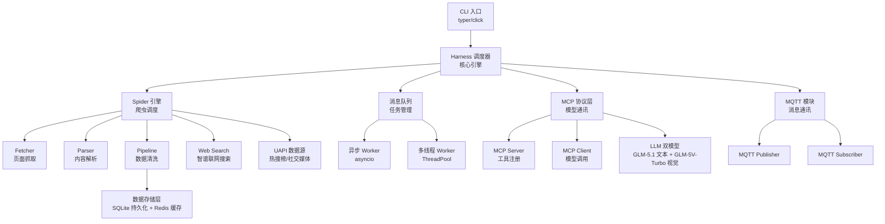

# a_Spide_agent - 项目 AI 上下文文档

## 变更记录 (Changelog)

| 日期 | 操作 | 说明 |
|------|------|------|
| 2026-04-08 | 初始化 | 首次扫描，项目空白阶段 |
| 2026-04-08 | 重建 | 基于详细项目描述重建文档，明确技术栈与架构设计 |
| 2026-04-08 | 补充 | 确认存储方案 SQLite+Redis，MQTT 云服务配置，创建 .gitignore |
| 2026-04-08 | 补充 | 增加 GLM-5.1 文本模型 + GLM-5V-Turbo 多模态视觉模型配置 |
| 2026-04-08 | 补充 | 增加联网搜索工具（智谱 Web Search API），增加 UAPI 数据源 |
| 2026-04-10 | 集成 | 集成 OpenCLI Skills（6 个），新增浏览器自动化/适配器开发/智能搜索能力 |
| 2026-04-10 | 新增 | 新增 spide-search-fallback skill（智谱 Web Search API 错误恢复搜索） |

---

## 项目愿景

**a_Spide_agent** 是一个**热点新闻信息抓取与智能整理 Agent CLI 工具**，具备以下核心能力：

- **热点信息抓取**：自动化采集热点新闻及相关资讯
- **Agent CLI**：命令行交互式智能代理
- **MCP 协议支持**：兼容 Model Context Protocol，支持与 AI 模型的标准化通讯
- **Harness Engineering 架构**：模块化、可插拔的工程架构
- **多线程 + 异步执行**：高性能并发任务处理
- **消息队列管理**：同步消息的队列化调度模式
- **MQTT 通讯**：轻量级消息传输协议支持
- **多数据源聚合**：UApiPro 热搜榜 + 智谱联网搜索双通道
- **浏览器自动化**：基于 OpenCLI 的 Chrome 浏览器控制，复用已有登录会话
- **智能搜索路由**：AI + 多源（60+ 网站）的智能搜索调度
- **适配器生态**：OpenCLI 适配器开发与自动修复能力

---

## 架构总览

### 技术栈

| 层面 | 技术选型 | 说明 |
|------|----------|------|
| 编程语言 | **Python 3.12+** | 主开发语言 |
| 异步框架 | **asyncio + aiohttp** | 异步 HTTP 与协程调度 |
| MQTT 客户端 | **aiomqtt** | MQTT 云服务接入 |
| 消息队列 | **asyncio.Queue** | 任务队列管理 |
| CLI 框架 | **Typer** | 命令行界面构建 |
| MCP 协议 | **mcp-sdk (Python)** | Model Context Protocol 支持 |
| LLM 文本模型 | **GLM-5.1 (智谱 AI)** | 文本理解/生成，Function Call，MCP 工具调用 |
| LLM 视觉模型 | **GLM-5V-Turbo (智谱 AI)** | 多模态视觉理解，图像/视频/文档分析 |
| LLM SDK | **zai-sdk** | 智谱 AI Python SDK |
| 联网搜索 | **Web Search API (智谱 AI)** | 结构化搜索结果，多引擎支持 |
| 数据源 API | **UApiPro (uapis.cn)** | 100+ 免费 API，热搜榜/社交媒体/新闻数据 |
| 数据源 SDK | **uapi-sdk-python** | UApiPro Python SDK |
| 浏览器自动化 | **OpenCLI (@jackwener/opencli)** | Chrome 浏览器 CLI 控制，79+ 网站适配器 |
| 多线程 | **concurrent.futures** | CPU 密集型任务的多线程执行 |
| 数据存储 | **SQLite + Redis** | SQLite 持久化 + Redis 缓存/队列 |
| 测试框架 | **pytest + pytest-asyncio** | 异步测试支持 |
| 包管理 | **uv** | 依赖管理与虚拟环境 |

### 架构模式：Harness Engineering

采用 **Harness（线束）架构**，核心思想：

- **中心调度器 (Harness)** 作为主控节点，协调各模块
- **插件化模块** 独立开发，通过标准化接口接入
- **消息总线** 连接各模块，解耦通讯
- **可插拔设计** 支持动态加载/卸载功能模块

---

## 模块结构图 (Mermaid)



---

## 推荐目录结构

```
a_Spide_agent/
├── src/
│   ├── __init__.py
│   ├── main.py                    # CLI 入口 (Typer app)
│   ├── harness/                   # Harness 核心调度引擎
│   │   ├── __init__.py
│   │   ├── engine.py              # 主调度器
│   │   ├── config.py              # 全局配置
│   │   └── loader.py              # 插件加载器
│   ├── spider/                    # 爬虫引擎模块
│   │   ├── __init__.py
│   │   ├── fetcher.py             # 异步页面抓取器
│   │   ├── parser.py              # HTML/JSON 内容解析器
│   │   ├── pipeline.py            # 数据清洗与结构化管道
│   │   ├── scheduler.py           # 爬取调度策略
│   │   ├── web_search.py          # 智谱联网搜索接口
│   │   └── uapi_client.py         # UAPI 数据源客户端
│   ├── mcp/                       # MCP 协议层
│   │   ├── __init__.py
│   │   ├── server.py              # MCP Server（工具注册）
│   │   ├── client.py              # MCP Client（模型调用）
│   │   └── tools.py               # MCP 工具定义
│   ├── queue/                     # 消息队列管理
│   │   ├── __init__.py
│   │   ├── broker.py              # 队列代理（asyncio.Queue 封装）
│   │   ├── async_worker.py        # 异步 Worker
│   │   └── thread_worker.py       # 多线程 Worker
│   ├── mqtt/                      # MQTT 通讯模块
│   │   ├── __init__.py
│   │   ├── client.py              # MQTT 客户端封装
│   │   ├── publisher.py           # 消息发布
│   │   └── subscriber.py          # 消息订阅
│   └── storage/                   # 数据存储层 (SQLite + Redis)
│       ├── __init__.py
│       ├── models.py              # 数据模型定义 (SQLAlchemy / dataclass)
│       ├── sqlite_repo.py         # SQLite 持久化仓库
│       ├── redis_cache.py         # Redis 缓存与去重
│       └── repository.py          # 统一存储接口 (抽象层)
├── tests/                         # 测试目录
│   ├── conftest.py                # pytest 共享 fixtures
│   ├── test_harness/
│   ├── test_spider/
│   ├── test_mcp/
│   ├── test_queue/
│   └── test_mqtt/
├── configs/                       # 配置文件目录
│   ├── llm.yaml                   # GLM-5.1 + GLM-5V-Turbo API 配置（敏感，不入 Git）
│   ├── mqtt.yaml                  # MQTT 云服务连接配置（敏感，不入 Git）
│   ├── uapi.yaml                  # UAPI 数据源配置（敏感，不入 Git）
│   └── default.yaml               # 默认配置
├── CA/                            # TLS 证书目录（不入 Git）
│   └── emqxsl-ca.crt              # EMQX Cloud CA 证书
├── pyproject.toml                 # 项目依赖与元数据
├── .python-version                # Python 版本锁定
├── .gitignore                     # 忽略敏感文件（configs/mqtt.yaml, CA/）
├── CLAUDE.md                      # 本文件
└── .spec-workflow/                # 规范文档工作流模板（已有）
```

---

## 模块索引

| 模块路径 | 语言 | 职责 | 入口文件 | 核心依赖 |
|----------|------|------|----------|----------|
| `src/harness/` | Python | Harness 核心调度引擎，插件加载与全局配置 | `engine.py` | - |
| `src/spider/` | Python | 爬虫引擎，页面抓取/解析/清洗 | `fetcher.py` | aiohttp, beautifulsoup4 |
| `src/mcp/` | Python | MCP 协议层，Server/Client 双向通讯 | `server.py` | mcp-sdk, zai-sdk |
| `src/spider/` (搜索) | Python | 联网搜索（智谱 Web Search API） | `web_search.py` | zai-sdk |
| `src/spider/` (数据源) | Python | UAPI 热搜榜/社交媒体数据采集 | `uapi_client.py` | uapi-sdk-python |
| `src/queue/` | Python | 消息队列管理，异步/多线程 Worker | `broker.py` | asyncio |
| `src/mqtt/` | Python | MQTT 云服务通讯，发布/订阅 | `client.py` | aiomqtt |
| `src/storage/` | Python | SQLite 持久化 + Redis 缓存/去重 | `repository.py` | aiosqlite, redis/aioredis |
| `.spec-workflow/` | Markdown | 规范文档工作流模板系统 | N/A | - |

---

## 运行与开发

### 环境要求

- Python 3.12+
- uv（推荐）或 pip 包管理器
- Redis 服务端（>= 7.0）用于缓存与去重
- MQTT 云服务：**EMQX Cloud（阿里云杭州）**
- LLM 文本模型：**GLM-5.1（智谱 AI）**，200K 上下文，128K 最大输出
- LLM 视觉模型：**GLM-5V-Turbo（智谱 AI）**，图像/视频/文档多模态理解

### LLM 模型配置

项目使用智谱 AI 双模型策略，共用同一 API Key：

| 项 | 文本模型 | 视觉模型 |
|---|---|---|
| 模型 ID | `glm-5.1` | `glm-5v-turbo` |
| 定位 | 旗舰文本基座 | 多模态 Coding 基座 |
| 输入模态 | 文本 | 图像(URL/Base64)、视频(URL)、文件(PDF/TXT)、文本 |
| 输出模态 | 文本 | 文本 |
| 上下文窗口 | 200K | 200K |
| 最大输出 | 128K | 128K |
| SDK | `zai-sdk` | `zai-sdk` |
| API 地址 | `https://open.bigmodel.cn/api/paas/v4` | 同左 |
| 深度思考 | 默认启用 | 默认启用 |
| 流式输出 | 默认启用 | 默认启用 |
| 特有能力 | Function Call, 结构化输出, MCP | 视觉理解, 视觉 Grounding, 文档理解 |

**使用场景分配：**
- **GLM-5.1**：新闻文本分析、内容摘要、指令理解、Function Call 工具调用、MCP 通讯
- **GLM-5V-Turbo**：新闻配图分析、网页截图理解、视频新闻内容提取、文档解析

> API Key 存储于 `configs/llm.yaml`，已被 `.gitignore` 排除。

### 联网搜索工具

智谱 AI 提供三大搜索服务，统一 API 接口，整合自研引擎及第三方（搜狗/夸克）：

| 服务 | 用途 | 说明 |
|------|------|------|
| **Web Search API** | 直接获取结构化搜索结果 | 标题/摘要/URL/网站名/图标/发布日期 |
| **Web Search in Chat** | 搜索 + LLM 融合回答 | 实时检索结果与模型生成无缝衔接 |
| **Search Agent** | 智能搜索体 | 意图拆解多轮搜索，综合生成全面回答 |

**搜索引擎选项：**

| 引擎 | 特性 | 价格 |
|------|------|------|
| `search_std` | 基础版（智谱自研），日常查询 | 0.01元/次 |
| `search_pro` | 高级版（智谱自研），多引擎协作 | 0.03元/次 |
| `search_pro_sogou` | 搜狗，覆盖腾讯生态/知乎 | 0.05元/次 |
| `search_pro_quark` | 夸克，垂直内容精准 | 0.05元/次 |

**项目默认配置：** `search_pro`，返回 15 条，高摘要字数，不限时效。

> 搜索配置存储于 `configs/llm.yaml` 的 `web_search` 节。

### UAPI 数据源

[UApiPro](https://uapis.cn) 提供 100+ 免费 API，本项目主要使用热搜榜和社交媒体数据：

| 数据源 | 说明 | 刷新间隔 |
|--------|------|----------|
| 微博热搜 | 实时热搜话题 | 5 分钟 |
| 百度热搜 | 热门搜索词 | 5 分钟 |
| 抖音热点 | 热门视频话题 | 3 分钟 |
| 知乎热榜 | 热门问答 | 5 分钟 |
| B站热搜 | 热门视频 | 5 分钟 |

| 项 | 值 |
|---|---|
| API 平台 | UApiPro (uapis.cn) |
| SDK | `uapi-sdk-python` |
| 认证 | API Key |
| 并发限制 | 5 并发 / 30 RPM |
| 重试策略 | 3 次，指数退避 |

> API Key 存储于 `configs/uapi.yaml`，已被 `.gitignore` 排除。

### MQTT 云服务配置

| 项 | 值 |
|---|---|
| 云服务商 | EMQX Cloud（阿里云杭州） |
| 连接地址 | `rd133da1.ala.cn-hangzhou.emqxsl.cn` |
| TLS/SSL 端口 | `8883` |
| WSS 端口 | `8084` |
| 认证方式 | 用户名/密码（见 `configs/mqtt.yaml`） |
| CA 证书 | `CA/emqxsl-ca.crt` |

> 凭证详情存储于 `configs/mqtt.yaml`，该文件及 `CA/` 目录已被 `.gitignore` 排除，不进入版本控制。

### 常用命令（待创建后生效）

```bash
# 安装依赖
uv sync

# 运行 CLI
python -m src.main --help

# 运行测试
uv run pytest

# 代码格式化
uv run ruff format .
uv run ruff check .

# 类型检查
uv run mypy src/
```

### OpenCLI 浏览器自动化集成

项目通过 [OpenCLI](https://github.com/jackwener/opencli) 集成了浏览器自动化和智能搜索能力，以 Claude Code Skills 形式提供。

**安装前提：**

```bash
npm install -g @jackwener/opencli
opencli doctor    # 验证 Chrome + Browser Bridge 扩展
```

**集成的 6 个 Skills：**

| Skill | 说明 | 触发场景 |
|-------|------|---------|
| `spide-browser` | 浏览器自动化控制（导航/点击/输入/提取） | 需要浏览网页、提取网页数据 |
| `spide-explorer` | 适配器探索式开发（API 发现/认证/编写/测试） | 为网站生成 CLI、探索 API |
| `spide-oneshot` | 快速单命令生成（URL → CLI，4 步完成） | 快速为某网页生成采集命令 |
| `spide-autofix` | 适配器自动修复（诊断/修复/验证） | opencli 命令失败时 |
| `spide-search` | 智能搜索路由（AI + 60+ 网站多源） | 搜索、查询、查找信息 |
| `spide-usage` | OpenCLI 使用参考（79+ 适配器命令手册） | 查询命令用法、查看支持网站 |
| `spide-search-fallback` | 错误恢复搜索（智谱 Web Search API → GitHub 搜错） | 采集失败且常规修复无效时 |

**能力范围：**
- 79+ 网站适配器（Bilibili, Twitter, Reddit, 小红书, 知乎等）
- 8 桌面应用（Cursor, ChatGPT, Notion, Discord 等）
- 公开 API 命令无需浏览器（HackerNews, arXiv, V2EX 等）
- 浏览器命令复用 Chrome 已有登录会话

### 开发流程

1. **Spec Workflow 驱动**：使用 `.spec-workflow/` 模板先文档后代码
2. **模块化开发**：每个模块独立开发，通过 Harness 接口集成
3. **异步优先**：I/O 密集型操作使用 asyncio，CPU 密集型使用多线程
4. **消息解耦**：模块间通过消息队列通讯，降低耦合

---

## 编码规范

### Python 规范

- **风格指南**：PEP 8，使用 Ruff 作为 linter/formatter
- **类型注解**：全面使用 type hints，mypy 严格模式
- **异步规范**：`async/await` 优先，避免回调地狱
- **命名约定**：
  - 模块/包：`snake_case`
  - 类：`PascalCase`
  - 常量：`UPPER_SNAKE_CASE`
  - 私有成员：`_leading_underscore`

### 架构规范

- **依赖注入**：模块通过接口依赖，不直接引用具体实现
- **配置外置**：所有配置项从 `configs/` 加载，不硬编码
- **错误处理**：统一异常层级，自定义业务异常
- **日志规范**：使用 `structlog` 结构化日志

---

## 测试策略

- **单元测试**：pytest + pytest-asyncio 覆盖核心逻辑
- **集成测试**：模块间交互测试
- **E2E 测试**：CLI 完整流程测试
- **覆盖率目标**：>= 80%
- **Mock 策略**：HTTP 请求使用 `aioresponses`，MQTT 使用 mock

---

## AI 使用指引

### 项目状态

本项目处于 **规划阶段 (Stage 0)**，AI 辅助开发时应：

1. **优先创建项目骨架** -- 按推荐目录结构生成 `pyproject.toml`、各模块 `__init__.py`、入口文件
2. **遵循 Harness 架构** -- 所有新模块必须通过标准化接口接入 Harness 调度器
3. **异步优先** — 抓取/通讯等 I/O 操作必须使用 asyncio
4. **遵循 MCP 协议规范** — 工具注册和模型调用需符合 MCP 标准

### 关键设计决策

| 决策 | 选择 | 理由 |
|------|------|------|
| CLI 框架 | Typer | 类型安全的 CLI 构建，自动生成帮助文档 |
| 异步模型 | asyncio | Python 原生异步，与 aiohttp 生态完美集成 |
| LLM 文本模型 | GLM-5.1 (智谱 AI) | 200K 上下文，Function Call，MCP 支持，长程任务能力强 |
| LLM 视觉模型 | GLM-5V-Turbo (智谱 AI) | 多模态视觉理解，图像/视频/文档分析，与文本模型共用 API Key |
| 联网搜索 | 智谱 Web Search API (search_pro) | 结构化搜索结果，多引擎协作，与 LLM 同生态集成 |
| 数据源 | UApiPro (uapis.cn) | 100+ 免费 API，微博/百度/抖音/知乎/B站热搜榜数据 |
| LLM SDK | zai-sdk | 智谱 AI 官方新版 Python SDK，接口简洁 |
| MQTT 库 | aiomqtt | 基于 asyncio 的 MQTT 客户端，对接 EMQX Cloud |
| 持久化存储 | SQLite + aiosqlite | 轻量级关系数据库，异步驱动，适合嵌入式单机部署 |
| 缓存/去重 | Redis + aioredis | 高性能 KV 缓存，用于 URL 去重、热数据缓存、任务状态管理 |
| 消息队列 | asyncio.Queue | 轻量级，无需额外依赖，适合单进程场景 |
| Linter | Ruff | 速度快，功能全（lint + format），替代 flake8 + black |
| 浏览器自动化 | OpenCLI (@jackwener/opencli) | Chrome CLI 控制，79+ 适配器，复用登录会话 |

---

## 版权与版本管理

- **作者：** 外星动物（常智） / IoTchange / 14455975@qq.com
- **版权：** Copyright (C) 2026 IoTchange - All Rights Reserved
- **本软件为专有软件，未经授权不得复制、修改或分发。**

### Git 版本号规则 (V3.1.1)

版本号格式：`V{主版本}.{次版本}.{小修改}`

| 位 | 规则 | 说明 |
|----|------|------|
| 主版本 | 起始为 `3` | 重大架构变更时递增 |
| 次版本 | **奇数 = DEV（开发测试版）** | 功能不稳定，持续迭代中 |
| 次版本 | **偶数 = 正式/生产版** | 功能稳定，可用于生产环境 |
| 小修改 | 递增 | Bug 修复、小功能改进 |

**当前版本：V3.1.1（DEV 开发测试版）**

---

## 文件统计

| 指标 | 数量 |
|------|------|
| 总文件数 | 7 |
| Markdown 文件 | 7 |
| 源代码文件 | 0 |
| 配置文件 | 0 |
| 测试文件 | 0 |
