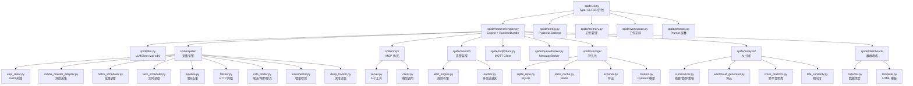

# SpideHarness Agent — 项目 AI 上下文文档

> 📍 [根目录](./) | 当前版本: V3.1.1 (DEV) | 最后更新: 2026-05-21

## 变更记录

| 日期 | 操作 | 说明 |
|------|------|------|
| 2026-04-08 | 初始化 | 首次扫描，项目空白阶段 |
| 2026-04-08 | 重建 | 基于详细项目描述重建文档，明确技术栈与架构设计 |
| 2026-04-08 | 补充 | SQLite+Redis，MQTT，GLM 双模型，UAPI 数据源 |
| 2026-04-10 | 集成 | OpenCLI Skills（6→7 个），浏览器自动化 |
| 2026-05-20 | 重建 | 全仓扫描，从"规划阶段"升级为"已实现"状态，生成模块级文档 |
| 2026-05-21 | 优化 | 测试审查优化（3 轮），新增 logging 测试 |
| 2026-05-21 | 深化 | 数据采集 5 方向深化：增量采集/关键词告警/深度追踪/跨平台分析/反爬稳定 |

---

## 项目概述

**SpideHarness Agent** 是一个热点新闻信息抓取与智能整理 Agent CLI 工具，基于 Harness Engineering 架构。

核心能力：热搜采集（UAPI）→ 增量检测 → 关键词告警 → 深度追踪（搜索+LLM） → 跨平台关联分析 → 数据看板 → 多通道输出（SQLite/Excel/MQTT）。

## 当前状态：**已实现 (Stage 2)**

- ✅ CLI 完整实现（21 个命令）
- ✅ Harness 调度引擎（RuntimeBundle + 管道编排）
- ✅ 热搜采集（UAPI 5 大平台）+ 限流熔断
- ✅ 深度采集（MediaCrawler 7 平台适配器）+ 断点恢复
- ✅ LLM 集成（GLM-5.1 + Web Search）
- ✅ MCP Server/Client（8 个工具）
- ✅ MQTT 通讯（TLS + EMQX Cloud）
- ✅ 消息总线（asyncio.Queue pub/sub）
- ✅ SQLite 持久化 + Redis 缓存
- ✅ 增量采集（Diff 检测 + 状态标记 NEW/RISING/FALLING/DROPPED）
- ✅ 关键词监控与告警（规则引擎 + 多渠道通知：Log/MQTT/Webhook/飞书）
- ✅ 内容深度追踪（自动搜索 + LLM 摘要 + 情感分析）
- ✅ 跨平台关联分析（LLM 语义聚类 + 标题相似度）
- ✅ 反爬稳定性（令牌桶限流 + 熔断器 + 断点恢复）
- ✅ AI 分析（趋势分析/内容摘要/词云/采集策略）
- ✅ Dashboard 数据看板
- ✅ 数据导出（JSON/JSONL/CSV/Excel）
- ✅ 定时调度 + 批量采集
- ✅ 工作空间管理 + Prompt 层叠系统
- ✅ 测试：36 个测试文件，360 个测试用例

---

## 架构总览

### 技术栈

| 层面 | 选型 |
|------|------|
| 语言 | Python 3.12+ |
| CLI | Typer + Rich |
| 异步 | asyncio + aiohttp |
| LLM | GLM-5.1 / GLM-5V-Turbo (zai-sdk) |
| 数据源 | UApiPro (aiohttp REST) |
| 深度采集 | MediaCrawler (Playwright) |
| 协议 | MCP (mcp-sdk) |
| MQTT | aiomqtt (EMQX Cloud TLS) |
| 存储 | SQLite (aiosqlite) + Redis |
| 测试 | pytest + pytest-asyncio |
| Lint | Ruff (lint + format) |
| 构建 | hatchling |

### 模块结构图


```mermaid
graph TD
    CLI["spide/cli.py<br/>Typer CLI (21 命令)"]
    CLI --> Engine["spide/harness/engine.py<br/>Engine + RuntimeBundle"]

    Engine --> LLM["spide/llm.py<br/>LLMClient (zai-sdk)"]
    Engine --> Spider["spide/spider/<br/>采集引擎"]
    Engine --> MCP["spide/mcp/<br/>MCP 协议"]
    Engine --> Monitor["spide/monitor/<br/>告警监控"]

    Spider --> UAPI["uapi_client.py<br/>UAPI 热搜"]
    Spider --> MCAdapter["media_crawler_adapter.py<br/>深度采集"]
    Spider --> BatchSched["batch_scheduler.py<br/>批量调度"]
    Spider --> TaskSched["task_scheduler.py<br/>定时调度"]
    Spider --> Pipeline["pipeline.py<br/>清洗去重"]
    Spider --> Fetcher["fetcher.py<br/>HTTP 抓取"]
    Spider --> RateLimiter["rate_limiter.py<br/>限流/熔断/断点"]
    Spider --> Incremental["incremental.py<br/>增量检测"]
    Spider --> DeepTracker["deep_tracker.py<br/>深度追踪"]

    Monitor --> AlertEngine["alert_engine.py<br/>规则引擎"]
    Monitor --> Notifier["notifier.py<br/>多渠道通知"]

    MCP --> MCPServer["server.py<br/>5 个工具"]
    MCP --> MCPClient["client.py<br/>模型调用"]

    Engine --> MQTT["spide/mqtt/client.py<br/>MQTT Client"]
    Engine --> Broker["spide/queue/broker.py<br/>MessageBroker"]
    Engine --> Storage["spide/storage/<br/>持久化"]
    Engine --> Analysis["spide/analysis/<br/>AI 分析"]
    Engine --> Dashboard["spide/dashboard/<br/>数据看板"]

    Storage --> SQLite["sqlite_repo.py<br/>SQLite"]
    Storage --> Redis["redis_cache.py<br/>Redis"]
    Storage --> Exporter["exporter.py<br/>导出"]
    Storage --> Models["models.py<br/>Pydantic 模型"]

    Analysis --> Summarizer["summarizer.py<br/>摘要/趋势/策略"]
    Analysis --> WC["wordcloud_generator.py<br/>词云"]
    Analysis --> CrossPlatform["cross_platform.py<br/>跨平台聚类"]
    Analysis --> Similarity["title_similarity.py<br/>相似度"]

    Dashboard --> Collector["collector.py<br/>数据聚合"]
    Dashboard --> Template["template.py<br/>HTML 模板"]

    CLI --> Config["spide/config.py<br/>Pydantic Settings"]
    CLI --> Memory["spide/memory.py<br/>记忆管理"]
    CLI --> Workspace["spide/workspace.py<br/>工作空间"]
    CLI --> Prompts["spide/prompts.py<br/>Prompt 层叠"]

    click Spider "./spide/spider/CLAUDE.md" "Spider 模块"
    click Engine "./spide/harness/CLAUDE.md" "Harness 模块"
    click MCP "./spide/mcp/CLAUDE.md" "MCP 模块"
    click MQTT "./spide/mqtt/CLAUDE.md" "MQTT 模块"
    click Broker "./spide/queue/CLAUDE.md" "Queue 模块"
    click Storage "./spide/storage/CLAUDE.md" "Storage 模块"
    click Analysis "./spide/analysis/CLAUDE.md" "Analysis 模块"
    click Dashboard "./spide/dashboard/CLAUDE.md" "Dashboard 模块"
```

---

## 实际目录结构

```
Spide_agent/
├── spide/                          # 主源码包
│   ├── __init__.py                 # __version__ = "1.1.1"
│   ├── __main__.py                 # python -m spide 入口
│   ├── cli.py                      # Typer CLI — 21 个命令
│   ├── config.py                   # Pydantic Settings + YAML 加载
│   ├── exceptions.py               # 统一异常层级 (8 个异常类)
│   ├── llm.py                      # LLMClient (zai-sdk 封装)
│   ├── logging.py                  # structlog 配置
│   ├── memory.py                   # 文件系统记忆 CRUD
│   ├── prompts.py                  # Prompt 层叠组装系统
│   ├── session_storage.py          # 会话快照持久化
│   ├── workspace.py                # ~/.spide_agent/ 工作空间管理
│   ├── spider/                     # 爬虫引擎
│   │   ├── fetcher.py              # AsyncFetcher (aiohttp + BeautifulSoup)
│   │   ├── pipeline.py             # 数据清洗/去重/解析
│   │   ├── uapi_client.py          # UAPI 热搜 REST 客户端（限流+熔断）
│   │   ├── media_crawler_adapter.py # MediaCrawler 深度采集适配器
│   │   ├── batch_scheduler.py      # 批量多平台并行调度（熔断+断点）
│   │   ├── task_scheduler.py       # 定时采集调度器
│   │   ├── rate_limiter.py         # 令牌桶限流 + 熔断器 + 断点管理
│   │   ├── incremental.py          # 增量检测器（Diff + 状态标记）
│   │   └── deep_tracker.py         # 话题深度追踪（搜索+摘要+情感）
│   ├── monitor/                    # 告警监控
│   │   ├── alert_engine.py         # 告警规则引擎（关键词/热度/状态）
│   │   └── notifier.py             # 多渠道通知（Log/MQTT/Webhook/飞书）
│   ├── harness/                    # 核心调度引擎
│   │   └── engine.py               # Engine + RuntimeBundle
│   ├── mcp/                        # MCP 协议层
│   │   ├── server.py               # MCP Server (stdio, 8 个工具)
│   │   ├── client.py               # MCP Client
│   │   ├── tools.py                # 工具定义 (JSON Schema)
│   │   └── search_provider.py      # 搜索适配器（DuckDuckGo/网页抓取/GitHub）
│   ├── mqtt/                       # MQTT 通讯
│   │   └── client.py               # MQTTClient (TLS + aiomqtt)
│   ├── queue/                      # 消息总线
│   │   └── broker.py               # MessageBroker (pub/sub)
│   ├── storage/                    # 数据存储
│   │   ├── models.py               # Pydantic 数据模型 (15 个实体 + 8 个枚举)
│   │   ├── sqlite_repo.py          # SQLite 异步仓库 (12 个表)
│   │   ├── redis_cache.py          # Redis 缓存
│   │   ├── repository.py           # 抽象仓库接口
│   │   └── exporter.py             # JSON/JSONL/CSV/Excel 导出
│   ├── analysis/                   # AI 分析
│   │   ├── summarizer.py           # 趋势分析/内容摘要/采集策略
│   │   ├── wordcloud_generator.py  # 词云生成 (jieba + wordcloud)
│   │   ├── cross_platform.py       # 跨平台关联分析 (LLM 语义聚类)
│   │   └── title_similarity.py     # 标题相似度 (Jaccard + 编辑距离)
│   ├── dashboard/                  # 数据看板
│   │   ├── collector.py            # 数据聚合
│   │   ├── template.py             # HTML 模板
│   │   └── renderer.py             # 渲染 + 输出
│   └── gateway/                    # 网关（预留）
│       └── __init__.py
├── tests/                          # 测试
│   ├── conftest.py
│   ├── unit/                       # 单元测试 (29 个)
│   ├── integration/                # 集成测试 (5 个)
│   └── e2e/                        # E2E 测试 (4 个)
├── configs/                        # 配置文件 (不入 Git)
│   ├── default.yaml
│   ├── llm.yaml
│   ├── mqtt.yaml
│   ├── uapi.yaml
│   └── alert_rules.yaml            # 告警规则模板
├── CA/                             # TLS 证书 (不入 Git)
├── Mcaclaw/                        # macOS 安装引导脚本
├── MediaCrawler/                   # MediaCrawler 子项目 (git submodule/拷贝)
├── OpenHarness/                    # OpenHarness 参考实现
├── docs/                           # 文档
├── scripts/                        # 工具脚本
├── skills/                         # Skill 定义
├── pyproject.toml                  # 项目元数据 + 依赖
└── CLAUDE.md                       # 本文件
```

---

## 模块索引

| 模块 | 文件数 | 行数 | 职责 | 模块文档 |
|------|--------|------|------|----------|
| `spide/` (根级) | 11 | ~2700 | CLI、配置、LLM、记忆、工作空间 | — |
| `spide/spider/` | 10 | ~3100 | 采集引擎（UAPI/深度/调度/限流/增量/追踪） | [CLAUDE.md](./spide/spider/CLAUDE.md) |
| `spide/monitor/` | 3 | ~400 | 告警监控（规则引擎/多渠道通知） | — |
| `spide/harness/` | 2 | ~420 | 核心调度引擎 | [CLAUDE.md](./spide/harness/CLAUDE.md) |
| `spide/mcp/` | 5 | ~960 | MCP 协议（Server/Client/工具/搜索适配器） | [CLAUDE.md](./spide/mcp/CLAUDE.md) |
| `spide/mqtt/` | 2 | ~210 | MQTT 通讯（TLS + aiomqtt） | [CLAUDE.md](./spide/mqtt/CLAUDE.md) |
| `spide/queue/` | 2 | ~145 | 消息总线（pub/sub） | [CLAUDE.md](./spide/queue/CLAUDE.md) |
| `spide/storage/` | 6 | ~1550 | SQLite/Redis/导出/模型 | [CLAUDE.md](./spide/storage/CLAUDE.md) |
| `spide/analysis/` | 5 | ~910 | AI 分析（摘要/趋势/词云/聚类/相似度） | [CLAUDE.md](./spide/analysis/CLAUDE.md) |
| `spide/dashboard/` | 4 | ~700 | 数据看板（HTML 生成） | [CLAUDE.md](./spide/dashboard/CLAUDE.md) |
| `tests/` | 34 | ~5000 | 测试（单元/集成/E2E） | [CLAUDE.md](./tests/CLAUDE.md) |
| **总计** | **59** | **~9635** | | |

---

## CLI 命令速查

| 命令 | 用途 |
|------|------|
| `spide` | 欢迎信息 |
| `spide init` | 初始化工作空间 |
| `spide config` | 配置检查 |
| `spide doctor` | 环境健康检查 |
| `spide crawl -s weibo` | 热搜采集 |
| `spide crawl-diff -s weibo` | 采集 + 增量差异对比 |
| `spide deep-crawl -p xhs` | 深度采集 |
| `spide batch-crawl -p xhs,dy` | 批量多平台采集（支持 --resume 断点续采） |
| `spide run "分析热搜"` | Agent 任务 |
| `spide analyze -s weibo` | AI 分析 |
| `spide monitor` | 关键词监控与告警（--once 单次 / --rules 自定义规则） |
| `spide track -s weibo --top 10` | 热搜深度追踪（搜索+摘要+情感） |
| `spide cross-analyze` | 跨平台关联分析（--save 持久化 / --report 生成报告） |
| `spide export -s weibo -f excel` | 数据导出 |
| `spide wordcloud -s weibo` | 词云生成 |
| `spide dedup` | 数据去重 |
| `spide dashboard` | 数据看板 |
| `spide schedule start` | 定时调度 |
| `spide mcp-serve` | 启动 MCP Server |
| `spide mqtt pub` / `sub` | MQTT 消息 |
| `spide memory list` / `add` | 记忆管理 |

---

## 数据流

```
UAPI/MediaCrawler → Pipeline(清洗去重) → IncrementalDetector(增量检测)
                                        → SQLite 持久化
                                        → Redis 缓存
                                        → AlertEngine(关键词告警) → Notifier(多渠道通知)
                                        → DeepTracker(深度追踪) → LLM 摘要/情感
                                        → CrossPlatformAnalyzer(跨平台聚类)
                                        → Dashboard 看板
                                        → Exporter (JSON/CSV/Excel)
                                        → MQTT 广播
                                        → LLM 分析 (趋势/摘要/策略)
```

## 配置加载

`spide/config.py` — Pydantic Settings，按优先级合并：

1. `configs/default.yaml` → `configs/llm.yaml` → `configs/mqtt.yaml` → `configs/uapi.yaml` → `configs/alert_rules.yaml`
2. 环境变量覆盖：`SPIDE_LLM__COMMON__API_KEY=xxx`（双下划线分隔层级）

## LLM 模型

| 模型 | ID | 用途 |
|------|----|------|
| GLM-5.1 | `glm-5.1` | 文本对话、摘要、趋势分析、聚类、Function Call |
| GLM-5V-Turbo | `glm-5v-turbo` | 图像/视频/文档多模态理解 |

共用 API Key，SDK: `zai-sdk`，API: `https://open.bigmodel.cn/api/paas/v4`

---

## 常用命令

```bash
uv sync                              # 安装依赖
spide --help                         # CLI 帮助
spide doctor                         # 环境检查
uv run pytest                        # 运行全部测试（333 passed）
uv run pytest tests/unit/            # 仅单元测试
uv run pytest -m integration         # 集成测试（需网络）
uv run ruff format . && ruff check . # 格式化 + lint
```

---

## 编码规范

- **风格**: PEP 8, Ruff (lint + format), line-length=100
- **类型**: 全面 type hints, mypy 检查
- **异步**: `async/await` 优先, `asyncio.to_thread` 包装同步调用
- **命名**: `snake_case` 模块/函数, `PascalCase` 类, `UPPER_SNAKE` 常量
- **配置外置**: 所有配置从 `configs/` 加载
- **异常体系**: `SpideError` → 8 个子类 (Config/Storage/Spider/MCP/MQTT/LLM/Workspace/Analysis)
- **日志**: structlog 结构化日志, `get_logger(__name__)`
- **测试**: pytest + pytest-asyncio, `asyncio_mode = "auto"`
- **稳定性**: RateLimiter(令牌桶) + CircuitBreaker(熔断) + CheckpointManager(断点)

---

## 版权与版本

- **作者**: 外星动物（常智）/ IoTchange / 14455975@qq.com
- **版权**: Copyright (C) 2026 IoTchange - All Rights Reserved
- **版本**: V3.1.1 (DEV) — 奇数次版本 = 开发测试版
- **包版本**: 1.1.1 (pyproject.toml)

---

## 文件统计

| 指标 | 数量 |
|------|------|
| 源码文件 | 51 (.py) |
| 源码行数 | ~10,000 |
| 测试文件 | 47 (.py) |
| 测试行数 | ~5,200 |
| 测试用例 | 360 |
| 配置文件 | 5 (.yaml) |
| CLI 命令 | 21 |
| MCP 工具 | 8 |
| 数据模型 | 15 (Pydantic) |
| 异常类 | 8 |
